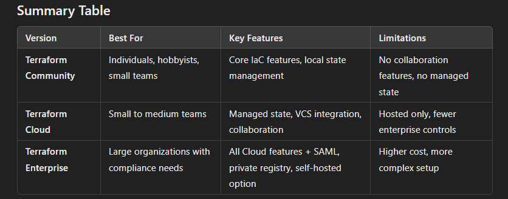
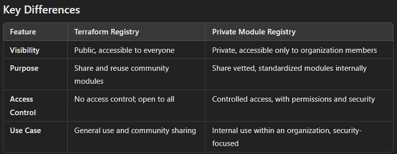

    • Modules
        ○ `Output` can be used to expose a variable which can then be retrieved using `module.<module name> .<output name>`
        ○ Requirements for publishing a module:
            § Three part name format -> terraform.<PROVIDER>-<NAME>
            § Module must be on gihub and must be a public repo
            § Tag names must be for the format x.y.z and can optionally be prefixed with a v, e.g. v1.0.4
        ○ Child module -> The module being called
        ○ Calling module -> The module that is using another module

    • Resource Dependencies
        ○ Terraform automatically analyzes expressions within a resource block to identify dependencies, this allows terraform to understand the order to which these resources should be created
        ○ Terraform uses Implicit dependencies/ordering by default
        ○ Implicit dependencies
            § Based on references in resource configurations
            § Terraform automatically knows to instantiate the referenced resource first
            § E.g. aws_vpc.main.id (it knows to create the vpc first)
        ○ Explicit dependencies
            § Used when terraform does not automatically infer dependencies (hence needs to be explicit)
            § `depends_on`
    • Environment Variables
        ○ A way to pass in parameters rather than hardcoding it in the code (more secure, maintainable)
        ○ `TF_VAR_<variable name> ` = can be used to pass in a variable name
    • Logging levels
        ○ TRACE -> Very fine grained step by step logging, debugging complex code or tracing execution paths
        ○ DEBUG -> Detailed info useful for debugging such a sinternal states and variable values
        ○ INFO -> General, high-level info about the app's normal operation
        ○ WARN -> warn about potential problematic situations
        ○ ERROR -> Logs errors that prevent parts of the application from working correctly
        ○ FATAL -> logs very severe errors  that likely cause the application to terminate

    • Terraform features
        ○ Terraform is immutable
            § Rather than modifications being made to existing infrastructure terraform typically replaces resources by creating new ones and destroying the old ones if needed.
        ○ Community providers -> Expand on Terraform's functionalities outside of hashiCorp (e.g. Okta)
        ○ Terraform does have built-in types to support backend in github (only s3, local and consul)
        ○ Pubic registry
            § Finding and using modules and providers (basically a community to help each other out)
            § source ="terraform-vault-aws-tgw/hcp"
                □ Typical format of fetching from a public registry
        ○ Terraform is NOT available for the AIX platform (it is for Linux, Windows, FreeBSD, Solaris, macOS)
        ○ Terraform console - > launch interactive console to evaluate and experiment with expressions
        ○ version ~> "5.36.0" -> means acceptable version is between 5.36.0 to 5.37.0
        ○ Terraform block
            § Used to define features about terraform itself (version, backend, provider)
        ○ Note -> terraform state also "increases performance"
            § Store current state rather than querying the actual resource from cloud provider's API
        ○ Encryption
            § Hashicorp Terraform (cloud, enterprise) always encrypts state at rest
            § Locally it is never encrypted at rest by default
            § `sensitive = true`
                □ Does not mask the state file
                □ Only hitdes it from command output
        ○ `required_providers` -> correct way to specify version of a provider
        ○ Once a terraform module version is downloaded it caches it and will use that version
        ○ Naming your primary file as main.tf is not mandatory
        ○ Explicitly stating a provider is not required in terraform, it can implicitly figure it out from the resources that you are trying to create
    • Built-in functions
        ○ lookup({"a": 1, "b": 2}, "b", 0) returns 2
        ○ Count -> takes in an integer to specify the number of resources it needs to create
        ○ For_each-> takes a collection (list, maps)
        ○ Element(<list>, index) -> indexing starts at zero
        ○ Object data type -> data structure with multiple attributes of different types
        ○ Data type:
            § Number is supported (it represents both int and a float)
            § Float -> is NOT SUPPORTED
    • Terraform Cloud
        ○ Centralized platform for managing terraform infra with features for collaboration state management and governance
        ○ Supports Role based access control
        ○ Automatically selects the most recent version of Terraform available
        ○ If migrating it uses the same terraform version that was used to perform the migration
        ○ A workspace can map to only one VCS
        ○ Agent - execute terraform plan and applies changes to infra, bridge between terraform cloud and target infra, they are lightweight servers, ran locally
        ○ Default behaviour
            § After approving merge request "speculative plan"
            § Basically a `terraform plan` after you merge a pull request or push changes
        ○ Workspace - not the same as `terraform workspace` they are more isolated and act like separate working directories, supporting more complex workflow.
            § Note -> Does not need to use CLI (`terraform workspace select`) to switch between workspace, there is a GUI
    • Terraform Community (Terraform CLI)
        ○ More for local development, for smaller teams, prototyping. When the project team grows -> Terraform cloud
        ○ Workspace - act as separate states within the same configuration directory, typically to manage different environments like dev, staging, or prod
    • Terraform enterprise
        ○ Private registry -
    

    
        ○ Terraform registry -> Not support all code repo
    • Syntax (best practices)
        ○ Two spaces for indentation when writing terraform blocks
    • Terraform x vault
        ○ Tight integration does not automatically mask secrets need developers
        ○ Direct querying secrets from vault is not recommended, instead use:
            § -backend-config=PATH
            § Interactively on the command line
            § Command-line key/value pairs
    • Dynamic Block
        ○ Basically a for loop that let's you create multiple blocks/multiple resources
        ○ E.g. think of a security group having multiple different ingress rules, instead of having a block of each, loop through all the ingress rules (in a form of a variable) in the dynamic block
    • Local Backend
        ○ Stores state on local filesystem
        ○ Locks the tate using system APIs and performs operations locally
        ○
    • Sentinel and OPA
        ○ Both are `policy as code` frameworks
        ○ Sentinel policy are enforced after the plan phase and before the apply phase
    • Loop through dictionary
        ○ For keys it is -> each.key
        ○ For value it is -> each.value.<name>
    • Backend
        ○ Syntax for backend always start with terraform{} block
